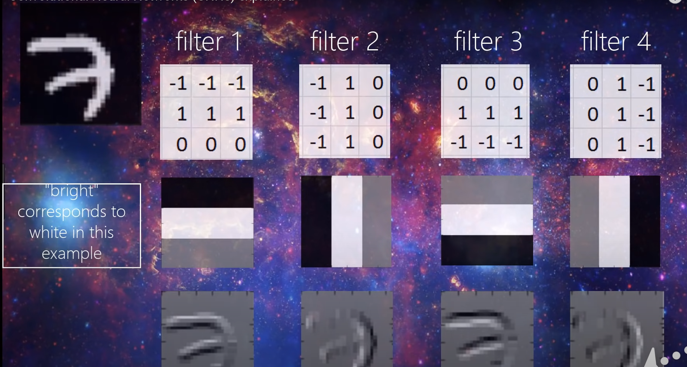

CNN takes the kernel size as an argument

number of filters per layer 

filter can detect patterns 

the filter within a layer can be represented as a matrix of values, initialized randomly. 

The filter "slides" through the data. 

  