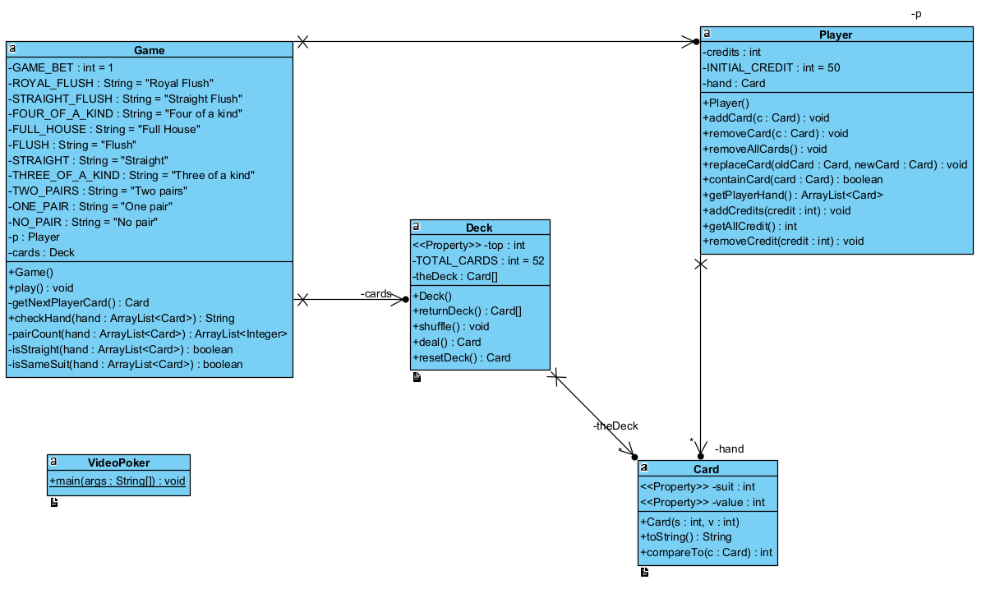
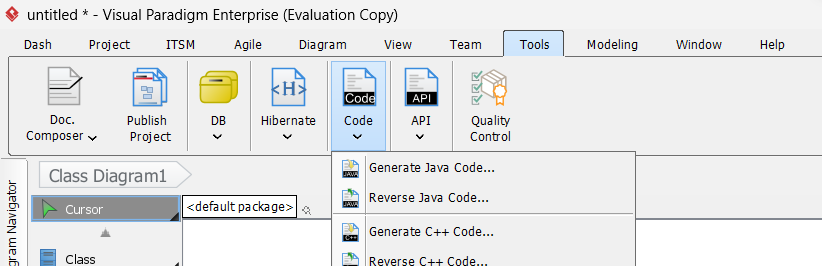
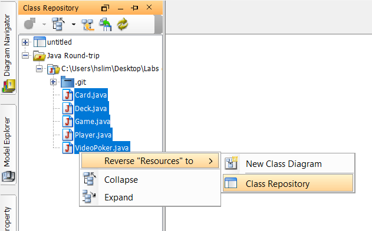
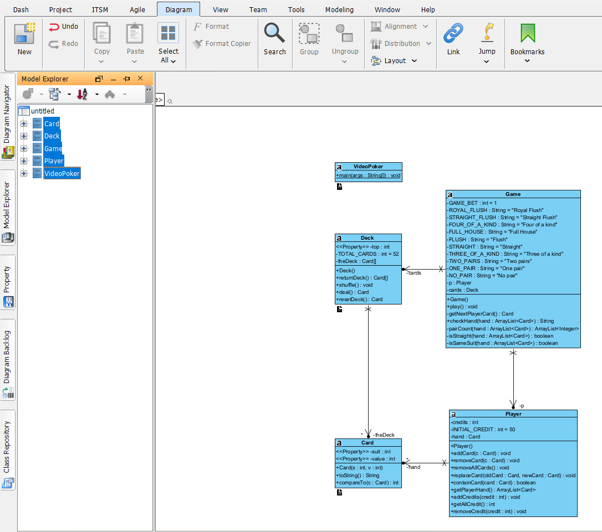
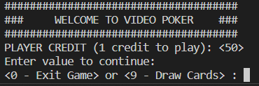

## Intro
Esta secção vai ser uma análise ao template arranjado no GitHub.

Os ficheiros estão no nosso repositório, [aqui](https://github.com/ricardo2000y/POO_PROJECT_POKER/tree/main/Video-Poker).

## Como é q isto ta interligado? 


  

??? tip "Sobre como é q foi feito o UML"

    Se quiseres saber como é q fiz este UML tá aqui, mas basicamente dá para fazer rever engineering com o Visual Paradigm diretamente do código. Tools>Code>Reverse Java Code

      

    Selecionas os .java

      

    Fazes um novo diagram e arrastas para lá as classes. Elas já vão estar interligadas. Might be useful para depois vermos se o nosso UML final está bem ou não.

      


`VideoPoker.class` - é tipo a main.class nos labs de java

Ela só inicializa o jogo basically, que na pratica é criar um novo objeto da `Game.class`:

??? example "Código da VideoPoker.class"

    ```java
    public class VideoPoker {
    public static void main(String[] args) {
        Game g = new Game();
        g.play();
    }
    } // end class VideoPoker
    ```

É chamado o método `play()` da classe `Game`. Este método é um loop infinito onde se joga o jogo. 

!!! note 
    O construtor do game cria um objeto da classe `Deck` e da classe `Player`.

??? warning "TODO"
    A bet do jogador está hardcoded a 1, tem de ser mudado depois:

    ```java
        // This is game bet that is debited from player's outstanding credit
        private final int GAME_BET = 1;
    ```

Dá print a isto e aguarda instruções do user:

  

Como é q isto funciona? 

- Existe um loop a ver se a resposta é de 0-9, se não for então diz q tá inválido e depois pede novamente.
    - Se for 0 então sai do prog
    - Se for 1-9 então é analisado noutra parte do código. (break do loop)

??? example "Loop do user input"

    ```java title="VideoPoker.class"
        // This loop will check if the player wants to continue the Game or Exit
        Scanner scan = new Scanner(System.in);
        while(true) {
            String tempValue = scan.nextLine();
            if(tempValue.equals("9")) {
            break;
            } else if(tempValue.equals("0")) {
            return;
            } else {
            System.out.print("Invalid entry. Please try again (Enter value: 0 or 9) - ");
            }
        }
    ```

Depois é feito um *Shuffle* do baralho. É um método da classe `Deck`, apropriadamente chamada xD. 

## Deck.class

### Criar o baralho 

1º - é criado (no construtor `Deck`) o baralho, basicamente 52 objetos da class `Card`. Ou melhor, um array de objetos com 52 posições. Vê o código abaixo q percebes. Ele chama este array `theDeck`.

!!! danger "Organização do baralho"

    O gajo q fez isto basicamente usou só inteiros, o q até inteligente porque assim faz combinações mais facilmente é usa menos memória a comparar cartas por exemplo, acho eu.

    Tem 2 argumentos/parametros para criar o objeto `Card`, que é o `suit` e o `value`. Suit vai de 1-4 (4 nipes) e o value 1-13 (cartas 2-10 + J Q K A)

    ??? tip "Código para criar o baralho"

        ```java
        public Deck () {
            // sendo total_cards = 52 
            theDeck = new Card [TOTAL_CARDS];
            top = 0;

            int suit = 1;
            int value = 1;

            for (int i = 0; i < theDeck.length; i++)
            {
            theDeck[i] = new Card (suit, value);
            value++;
            if (value > 13) { // new suit
                suit++;
                value = 1;
            }
            }
        }
        ```

    ??? idea "Criar o deck como queremos" 

        Como nós queremos ter `xH xS xC xD` podemos fazer o q escrevi nestes comentários, e posteriormente faziamos a concatenação do `x` com o `H`, vê se percebes pelos comentários.

        ```java
                int suit = 'H'; //neste caso seria string ou char
                int value = '2';
                for (int i = 0; i < theDeck.length; i++)
                {
                    theDeck[i] = new Card (suit, value);
                    //a primeira iteração vai criar uma carta 2H
                    
                    /*Podemos ter um loop dentro de outro loop:*/

                    /*LOOP DE FORA */
                    // mudar o nipe!
                        /*LOOP DE DENTRO */
                        /*temos agora de fazer a iteração do value de 2-10
                        verificar se o value já é = a 10 e depois passar para J,
                        depois passar para Q
                        depois passar para K
                        depois passar para A
                        muda de nipe no loop de fora*/
                }
            }       
        ```

### Shuffle do baralho

O gajo faz 1000 trocas entre 2 cartas com index random do baralho, not sure se é a maneira mais eficiente de fazer isto, mas tu és o rei do pensamento lógico deves saber se há maneira melhor ou não. 

```java
 public void shuffle () {
    int firstCard = 0;
    int secondCard = 0;

    for (int i = 0; i <= 1000; i++) // swaps two Card elements in the Deck
    {
      firstCard = (int) (Math.random () * TOTAL_CARDS);
      secondCard = (int) (Math.random () * TOTAL_CARDS);

      Card temp = theDeck[firstCard];
      theDeck[firstCard] = theDeck[secondCard];
      theDeck[secondCard] = temp;
    }
  }
```


## Atribuir mão

Ok, o proximo passo q o gajo faz depois de baralhar o deck é dar uma mão ao jogador. 

1º ele cria uma arrayList de `Card` vazia. (no constructor) e atribui os créditos iniciais ao player, 50.


