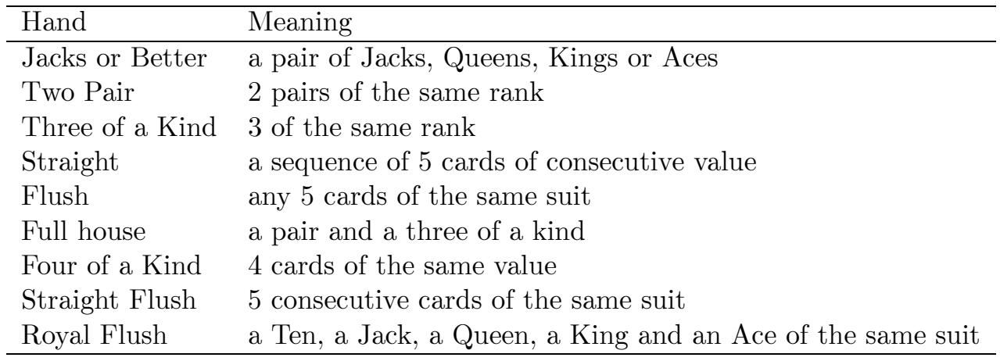
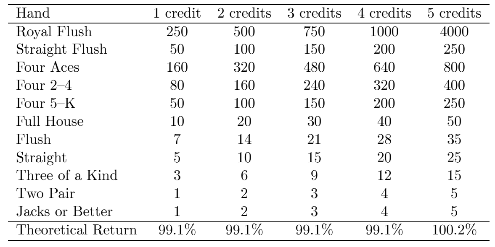
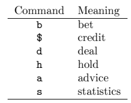
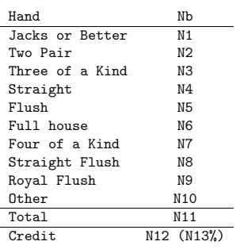

## Instruções do projeto

O projeto vai ser fazer um video poker.

Como é q isto funciona? Um gajo recebe 5 cartas à sorte do baralho, e pode trocar cada carta uma vez.

Depois a mão final dele é comparada com uma tabela de "mãos" e se ele tiver uma mão com valor é pago consoante o q tá na tabela. 

### Combinações Vitoriosas 

  


## Paytable 

  


## Variações de jogo

A variação do jogo vai ser *double bonus 10/7*. Tem um retorno de investimento teórico de 100.2% quando jogado com a estratégia perfeita. 

* Outside Straight -  3 4 5 6 **Q** -> carta a trocar nas pontas (para ser uma cena sucessiva)
* Inside Straight - 3 4 **Q** 6 7 -> carta a trocar no meio 

??? debug "Implementações:"

    - [x] Straight flush, four of a kind, royal flush
    - [ ] 4 to a royal flush
    - [ ] 3 ases
    - [ ] Straight, Flush, full house
    - [ ] Three of a kind (except aces)
    - [ ] 6. 4 to a straight flush
    - [ ] 7. Two pair
    - [ ] 8. High pair
    - [ ] 9. 4 to a flush
    - [ ] 10. 3 to a royal flush
    - [ ] 11. 4 to an outside straight
    - [ ] 12. Low pair
    - [ ] 13. AKQJ unsuited
    - [ ] 14. 3 to a straight flush (type 1)
    - [ ] 15. 4 to an inside straight with 3 high cards
    - [ ] 16. QJ suited
    - [ ] 17. 3 to a flush with 2 high cards
    - [ ] 18. 2 suited high cards
    - [ ] 19. 4 to an inside straight with 2 high cards
    - [ ] 20. 3 to a straight flush (type 2)
    - [ ] 21. 4 to an inside straight with 1 high card
    - [ ] 22. KQJ unsuited
    - [ ] 23. JT suited
    - [ ] 24. QJ unsuited
    - [ ] 25. 3 to a flush with 1 high card
    - [ ] 26. QT suited
    - [ ] 27. 3 to a straight flush (type 3)
    - [ ] 28. KQ, KJ unsuited
    - [ ] 29. Ace
    - [ ] 30. KT suited
    - [ ] 31. Jack, Queen or King
    - [ ] 32. 4 to an inside straight with no high cards
    - [ ] 33. 3 to a flush with no high cards
    - [ ] 34. Discard everything


## Modos do programa:

* Debug mode - O jogo é carregado de um ficheiro.
* Simulation mode - O jogo é jogado com a estratégia perfeita para avaliar o retorno do crédito investido do jogador.

### .Debug Mode

```card-file.txt title="card-file.txt"
2H KH 2S JS 6D JH TC 9H QC AS 8H 8D 7S 3H 7D 5S 7D 4D 5S 7S 3H 4H JS 4S
```

```cmd-file.txt title="cmd-file.txt"
b d h 1 3 $ b 10 b d $ h 3 4 b d a h 1 4
```
??? example "Output"
    ```debug output title="output na consola"
    # java -jar videopoker.jar -d 10000 cmd-file.txt card-file.txt

    -cmd b
    player is betting 5

    -cmd d
    player's hand 2H KH 2S JS 6D

    -cmd h 1 3
    player's hand 2H JH 2S TC 9H
    player loses and his credit is 9995

    -cmd $
    player's credit is 9995

    -cmd b 10
    b: illegal amount

    -cmd b
    player is betting 5

    -cmd d
    player's hand QC AS 8H 8D 7S

    -cmd $
    player's credit is 9990

    -cmd h 3 4
    player's hand 3H 7D 8H 8D 5S
    player loses and his credit is 9990

    -cmd b
    player is betting 5

    -cmd d
    player's hand 7D 4D 5S 7S 3H

    -cmd a
    player should hold cards 1 4

    -cmd h 1 4
    player's hand 7D 4H JS 7S 4S
    player wins with a TWO PAIR and his credit is 9990

    ```
Correr assim:

`java -jar <<YOUR-JAR-NAME>>.jar -d credit cmd-file card-file`

### Simulation Mode

Recebe os parametros:
- `credit` - Balanço inicial do jogador.
- `bet` - Valor a apostar por jogada durante a simulação.
- `nbdeals` - Número total de deals.

A simulação deve usar sempre a jogada "perfeita" seguindo a tap de  implementações.

!!! warning 
    No final da simulação tem de se fazer print das estatísticas

Correr assim: 

`java -jar <<YOUR-JAR-NAME>>.jar -s credit bet nbdeals` 

## Comandos e resultados

  

### Bet `b (i)`
O comando bet pode ser `b` ou `b i` em que `i` é o valor da aposta.

Se o comando for apenas `b` então `i` será o valor apostado anteriormente ou 5 caso não haja valor apostado anteriormente.

Se o jogador fizer `b` depois do deal ou durante a jogada do dealer deve-se fazer o print: `b: illegal command`. 
Vão existir outras ocasiões onde usar `b` é ilegal e deve-se fazer print de uma cena parecida.

### Credit `$`

Pode ser usado a qualquer altura do jogo.

### Deal `d`

Só pode ser usado depois de uma bet `b`.

### Hold `h`

Só pode ser usado depois de um deal `d`.

`h 1 2` -> vai manter as primeiras duas cartas e discard das outras 3.

Q♦ T♦ 8♥ 7♣
6♠ -> `h 1 2` -> Q♦ T♦ 7♥ 5♣
3♠ 

Depois do `h` ser usado, a consola dá print da nova mão do jogador. 

### Statistics `s`

Dá print de uma cena assim: 

  

* `N1...N10` - vezes que a jogada saiu. 
* `N11` - Numero de deals desde o inicio do jogo.
* `N13` - Ganho em percentagem relativamente ao ganho inicial 

$$ ganho \% = \frac{C_f}{C_i}100$$

### Advice `a`

Informa qual é a jogada que o jogador deve tomar de acordo com a estratégia ideal.

## Perda e vitória

Se o player perder:`‘‘player loses and his
credit is C’’ `

Se o player ganhar:`‘‘player wins with a H and his credit is C’’
`

* `C` - Crédito atual do jogador.
* `H` - Mão do jogador quando ganha.

## Ideia do HashMap para a statistic 

```java
// Import the HashMap class
import java.util.HashMap;

public class Main {
  public static void main(String[] args) {

    // Create a HashMap object called people
    HashMap<String, Integer> people = new HashMap<String, Integer>();

    // Add keys and values (Name, Age)
    people.put("John", 32);
    people.put("Steve", 30);
    people.put("Angie", 33);

    for (String i : people.keySet()) {
      System.out.println("Name: " + i + " Age: " + people.get(i));
    }
    
    people.merge("John",1,Integer::sum);
    System.out.println(people.get("John"));
  }
}
```


## Checkpoints 

- [x] 1 - `h 1 2 3 4 5`   9C
- [x] 2 - `h 1 2 4 5`     TD
- [x] 3 - `h 2 3 4 5 `    9S
- [x] 4 - `h 3 4 5`       2C
- [x] 5 - `h 1 2 3 4 5`   4C
- [x] 6-  `h 1 2 3 4 5`   5C
- [x] 7-  `h 1 2 3 4 5`   3D
- [x] 8-  `h 1 2 3 4 5`
- [x] 9- `h 1 2 3 4` 
- [x] 10- `h 2 3 4 5`     QS
- [x] 11- `h 4 5`         4D
- [x] 12- `h 3 4`         2C  
- [x] 13- `h 1 3 4 5`     8C
- [x] 14- `h 1 2 3 5`     2S
- [x] 15- `h 2 3 5`       5S
- [x] 16- `h 3 4 5`       8C
- [x] 17- `h 2 3 4 5`     7C
- [x] 18- `h 2 3 4 5`     4H
- [x] 19- `h 2 3`         3S 
- [x] 20- `h 1 2`         9H 
- [x] 21- `h 2 3 4 5`     8H
- [x] 22- `h 2 3 4 5`     8H
- [x] 23 - `h 2 3 4 5`    2C
- [x] 24- `h 2 4 5`       2H
- [x] 25 - `h 3 4 5`      3S
- [x] 26- `h 2 3 4 5`     7C 
- [x] 27 - `h 2 3 4 5`    6C
- [x] 28 - `h 2 3 4 5`    3C
- [x] 29 - `h 2 3 4 5`    8H - first check até aqui
- [x] 30 - `h 4 5`        4S
- [x] 31 - `h 4 5`        2C
- [x] 32 - `h 4 5`        2H
- [x] 33 - `h 1 4 5`      3H
- [x] 34  `h 4 5`             4D
- [x] 35  `h 1 4 5`        2C
- [x] 36 `h 4 5`  6C
- [x] 37 `h 4 5` 2S  
- [x] 38 `h 2 3 4 5` 4C 
- [x] 39 `h 2 3 4 5` 3D
- [x] 40 `h 2 3 5` 2H
- [x] 41 `h 2 3 4 5`4S
- [x] 42 `h 2 3 4 5`2D
- [x] 43 `h 1 2 3`2C
- [x] 44 `h 3 4` 2D
- [ ] 45 `h 4 5`2D
- [x] 46 `h 4 5` 2C
- [x] 47 `h 3 4`3D
- [x] 48 `h 3 4`  4D
- [ ] 49 `h 2 3 4 5` 6S -> muda o 6 p 9
- [x] 50 `h 4 5` 2C
- [x] 51 `h 4 5`2S
- [x] 52 `h 4 5` 3S
- [x] 53 `h 4 5` 5H
- [ ] 54 `h 3 4` 4H
- [x] 55 `h 4 5` 2D
- [x] 56 `h 3 4 5` 2D
- [x] 57 `h 2 3 4` 2C
- [x] 58 `h 1 4 5` 5D
- [x] 59 `h 3 4 5` 2D
- [x] 60 `h 1 3 5`6C
- [x] 61 `h 4 5` 2C
- [x] 62 `h 3 4` 4C
- [x] 63 `h 3 4` 6S
- [x] 64 `h 4 5` 6S
- [x] 65 `H 4 5` 3H
- [x] 66 `h 1 2 3`5C
- [ ] 67 `h 123`3H
- [ ] 68 `h 123`2C
- [ ] 69 `h124`2D
- [ ] 70 `h`4C
- [x] 71 `h 4 5`4D
- [ ] 72 `h 4 5`3D
- [x] 73 4S
- [x] 74 5S
- [x] 75 5H
- [ ] 76 `h 5`2C
- [x] 77 6C
- [ ] 78 `h 1 2 3`3H
- [ ] 79 `h 5` 2S
- [ ] 80 `h 5`2H
- [ ] 81 `h 1 2 3 4`2D
